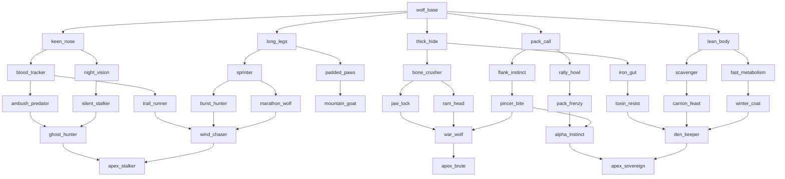

# Wolf evolution tree — structure sketch

**Status:** Draft for STEP-11 (≥30 nodes, branching DAG)  
**Locked rules:** `DESIGN_DECISIONS.md` (DEC-04 mate roll, DEC-05 per-wolf, DEC-06 apex = victory)

---

## Overview

| Metric | Value |
|--------|-------|
| **Total nodes** | 34 |
| **Root** | `wolf_base` |
| **Apex endings** | 3 (`apex_stalker`, `apex_brute`, `apex_sovereign`) — any apex death with valid heir = **lineage complete** |
| **Max depth** | 6 tiers (base → apex) |
| **Partner archetypes** | `forest_wolf`, `plains_wolf`, `tundra_wolf` bias different branches |

Roll happens **at mate** (gestation stores result). Son spawns with trait from rolled node.

---

## Branch themes

| Branch | Fantasy | Forest | Plains | Tundra |
|--------|---------|--------|--------|--------|
| **Senses** | Rastrear, emboscar, caçar à noite | Strong | Weak | Medium |
| **Mobility** | Correr, perseguir, terreno difícil | Weak | Strong | Medium |
| **Physique** | Tanque, mordida, resistência física | Medium | Medium | **Strong** |
| **Metabolism** | Fome/sede, inverno, carniça | Strong | Weak | **Strong** |
| **Pack** | Manada, flanquear, moral | Weak | Strong | Weak |

---

## Tree diagram (ASCII)

```
                              wolf_base
           ┌────────┬────────┬────────┬────────┬────────┐
           │        │        │        │        │        │
      keen_nose long_legs thick_hide lean_body pack_call
       ╱    ╲     ╱    ╲     ╱    ╲     ╱    ╲     ╱    ╲
 blood_trk night_vis sprinter pad_paws bone_crush iron_gut fast_meta scavenger flank_inst rally_howl
    ╱  ╲      │    ╱   ╲      │   ╲      │        │   ╲      │        │        ╲      ╱
ambush trail  │ burst marathon jaw_lock ram_head toxin_res winter coat carrion  pincer pack_frenzy
predator run  │ hunter wolf     │        │        │        │        feast    bite
    ╲    ╱    │    ╲   ╱       └────┬───┘        │        │          ╲      ╱
     ghost_hunter│  wind_chaser      │         den_keeper    │      alpha_instinct
         │       │       │           │              │         │           │
         │    mountain_goat          war_wolf ◄──────┴─────────┘           │
         │       │       │           │                                    │
         │       └───────┴──────── highlander (optional cross)              │
         │                       │                                         │
    apex_stalker            apex_brute                              apex_sovereign
    (senses apex)           (combat apex)                           (pack/survival apex)
```

**Merge nodes** (`ghost_hunter`, `wind_chaser`, `war_wolf`, `den_keeper`, `alpha_instinct`) can be reached from **multiple parents** — list the same child in each parent's `child_ids`.

---

## Mermaid (readable)



---

## Node catalog (34 nodes)

Stat keys match `WolfStats` + `NeedsComponent` tuning. Values are **additive** unless noted as multiplier in `metabolism`.

### Tier 0 — Root

| id | display_name | stat_deltas | child_ids |
|----|--------------|-------------|-----------|
| `wolf_base` | Grey Wolf | `{}` | `keen_nose`, `long_legs`, `thick_hide`, `lean_body`, `pack_call` |

**Base weights (equal):** each child `1.0`

---

### Tier 1 — First mutations (5)

| id | display_name | stat_deltas | child_ids | flavor |
|----|--------------|-------------|-----------|--------|
| `keen_nose` | Keen Nose | `hunger_decay: -0.15` | `blood_tracker`, `night_vision` | Cheiro aguçado |
| `long_legs` | Long Legs | `move_speed: 25` | `sprinter`, `padded_paws` | Pernas longas |
| `thick_hide` | Thick Hide | `max_health: 20` | `bone_crusher`, `iron_gut` | Couro grosso |
| `lean_body` | Lean Body | `metabolism: 0.85`, `move_speed: 10` | `fast_metabolism`, `scavenger` | Corpo magro |
| `pack_call` | Pack Call | `bite_damage: 3` | `flank_instinct`, `rally_howl` | Uivo de manada |

---

### Tier 2 — Specialization (10)

| id | display_name | stat_deltas | child_ids |
|----|--------------|-------------|-----------|
| `blood_tracker` | Blood Tracker | `hunger_decay: -0.1` | `ambush_predator`, `trail_runner` |
| `night_vision` | Night Vision | `move_speed: 5` | `silent_stalker` |
| `sprinter` | Sprinter | `move_speed: 20`, `metabolism: 1.1` | `burst_hunter`, `marathon_wolf` |
| `padded_paws` | Padded Paws | `move_speed: 8` | `mountain_goat` |
| `bone_crusher` | Bone Crusher | `bite_damage: 8` | `jaw_lock`, `ram_head` |
| `iron_gut` | Iron Gut | `max_health: 10` | `toxin_resist` |
| `fast_metabolism` | Fast Metabolism | `metabolism: 0.9`, `thirst_decay: -0.1` | `winter_coat` |
| `scavenger` | Scavenger | `hunger_decay: -0.2` | `carrion_feast` |
| `flank_instinct` | Flank Instinct | `bite_damage: 5` | `pincer_bite` |
| `rally_howl` | Rally Howl | `max_health: 8` | `pack_frenzy` |

---

### Tier 3 — Hunter roles (11)

| id | display_name | stat_deltas | child_ids |
|----|--------------|-------------|-----------|
| `ambush_predator` | Ambush Predator | `bite_damage: 6`, `move_speed: 5` | `ghost_hunter` |
| `trail_runner` | Trail Runner | `move_speed: 15` | `wind_chaser` |
| `silent_stalker` | Silent Stalker | `bite_damage: 4` | `ghost_hunter` |
| `burst_hunter` | Burst Hunter | `move_speed: 25`, `metabolism: 1.15` | `wind_chaser` |
| `marathon_wolf` | Marathon Wolf | `move_speed: 12`, `max_health: 5` | `wind_chaser` |
| `mountain_goat` | Mountain Goat | `move_speed: 10`, `max_health: 15` | `wind_chaser` |
| `jaw_lock` | Jaw Lock | `bite_damage: 12` | `war_wolf` |
| `ram_head` | Ram Head | `max_health: 15`, `bite_damage: 5` | `war_wolf` |
| `toxin_resist` | Toxin Resist | `max_health: 12` | `den_keeper` |
| `winter_coat` | Winter Coat | `hunger_decay: -0.15`, `thirst_decay: -0.1` | `den_keeper` |
| `carrion_feast` | Carrion Feast | `hunger_decay: -0.25` | `den_keeper` |
| `pincer_bite` | Pincer Bite | `bite_damage: 7` | `war_wolf`, `alpha_instinct` |
| `pack_frenzy` | Pack Frenzy | `bite_damage: 6`, `move_speed: 8` | `alpha_instinct` |

---

### Tier 4 — Merge elites (5)

| id | display_name | stat_deltas | child_ids | parents (incoming) |
|----|--------------|-------------|-----------|-------------------|
| `ghost_hunter` | Ghost Hunter | `bite_damage: 10`, `move_speed: 10` | `apex_stalker` | `ambush_predator`, `silent_stalker` |
| `wind_chaser` | Wind Chaser | `move_speed: 20`, `metabolism: 1.05` | `apex_stalker` | `trail_runner`, `burst_hunter`, `marathon_wolf`, `mountain_goat` |
| `war_wolf` | War Wolf | `bite_damage: 15`, `max_health: 20` | `apex_brute` | `jaw_lock`, `ram_head`, `pincer_bite` |
| `den_keeper` | Den Keeper | `max_health: 25`, `hunger_decay: -0.2` | `apex_sovereign` | `toxin_resist`, `winter_coat`, `carrion_feast` |
| `alpha_instinct` | Alpha Instinct | `bite_damage: 8`, `max_health: 18` | `apex_sovereign` | `pincer_bite`, `pack_frenzy` |

---

### Tier 5 — Apex / victory nodes (3)

| id | display_name | stat_deltas | child_ids | ending |
|----|--------------|-------------|-----------|--------|
| `apex_stalker` | Apex Stalker | `bite_damage: 12`, `move_speed: 15`, `hunger_decay: -0.1` | `[]` | Senses/speed mastery |
| `apex_brute` | Apex Brute | `bite_damage: 25`, `max_health: 40` | `[]` | Combat mastery |
| `apex_sovereign` | Apex Sovereign | `max_health: 35`, `bite_damage: 10`, `metabolism: 0.8` | `[]` | Pack/survival mastery |

**DEC-06:** Wolf at any apex node who dies with valid heir → **lineage complete** (victory screen).

---

## Partner `branch_weights` (mate roll bias)

Applied when rolling child from parent's `current_node_id` at mate time.

### `forest_wolf` (tag: *Forest blood*)

**Palette:** cinza e preto — floresta, sombra, pelagem escura.

| Role | Godot `Color` | Hex | Notes |
|------|---------------|-----|-------|
| `body_color` (placeholder) | `Color(0.42, 0.42, 0.45)` | `#6B6B73` | Cinza médio |
| Accent / darker fur | `Color(0.18, 0.18, 0.20)` | `#2E2E33` | Preto suave |

```json
{
  "keen_nose": 2.5,
  "night_vision": 2.0,
  "lean_body": 1.8,
  "scavenger": 1.5,
  "long_legs": 0.6,
  "pack_call": 0.7,
  "sprinter": 0.5
}
```

`stat_bias`: `{ "hunger_decay": 0.9, "move_speed": 0.95 }`

### `plains_wolf` (tag: *Plains blood*)

**Palette:** marrom e bege — estepe, terra seca, pelagem quente.

| Role | Godot `Color` | Hex | Notes |
|------|---------------|-----|-------|
| `body_color` (placeholder) | `Color(0.58, 0.44, 0.32)` | `#947052` | Marrom |
| Accent / lighter fur | `Color(0.78, 0.68, 0.52)` | `#C7AD85` | Bege |

```json
{
  "long_legs": 2.5,
  "sprinter": 2.0,
  "pack_call": 1.8,
  "flank_instinct": 1.5,
  "keen_nose": 0.6,
  "lean_body": 0.7,
  "scavenger": 0.5
}
```

`stat_bias`: `{ "move_speed": 1.1, "metabolism": 1.05 }`

### `tundra_wolf` (tag: *Tundra blood*)

**Palette:** branco — neve, gelo, pelagem clara.

| Role | Godot `Color` | Hex | Notes |
|------|---------------|-----|-------|
| `body_color` (placeholder) | `Color(0.93, 0.94, 0.96)` | `#EDEFF5` | Branco |
| Accent / shadow fur | `Color(0.82, 0.86, 0.90)` | `#D1DBE6` | Cinza gelo (sombra Y-sort) |

Cold-adapted lineage — favors physique, winter survival, and den-keeper paths over speed and pack tactics.

```json
{
  "thick_hide": 2.5,
  "lean_body": 2.0,
  "iron_gut": 2.0,
  "winter_coat": 2.2,
  "fast_metabolism": 1.6,
  "scavenger": 1.5,
  "mountain_goat": 1.8,
  "den_keeper": 1.5,
  "sprinter": 0.4,
  "pack_call": 0.5,
  "flank_instinct": 0.6,
  "burst_hunter": 0.5
}
```

`stat_bias`: `{ "max_health": 1.1, "hunger_decay": 0.88, "thirst_decay": 0.92 }`

### Partner colors (quick reference)

| archetype | palette | `body_color` |
|-----------|---------|--------------|
| `forest_wolf` | Cinza / preto | `Color(0.42, 0.42, 0.45)` |
| `plains_wolf` | Marrom / bege | `Color(0.58, 0.44, 0.32)` |
| `tundra_wolf` | Branco | `Color(0.93, 0.94, 0.96)` |

Set `body_color` on `PartnerWolf` scene instances (placeholder `Polygon2D`). Player / son wolves keep default grey unless trait overrides later.

Weights multiply `child_base_weights` from the parent node during mate roll.

---

## Example mate roll (pseudocode)

Parent at `wolf_base`, partner `forest_wolf`:

```
candidates = [keen_nose, long_legs, thick_hide, lean_body, pack_call]
weights = [2.5, 0.6, 1.0, 1.8, 0.7]  # base 1.0 × partner weight
→ likely: keen_nose or lean_body
→ son gestates 60s with trait from rolled tier-1 node
→ son's current_node_id = rolled id (per-wolf, DEC-05)
```

Next mate (parent still `wolf_base`, different partner): sibling can roll different branch.

Parent at `blood_tracker` + `plains_wolf`: favors `trail_runner` over `ambush_predator`.

Parent at `wolf_base` + `tundra_wolf`: favors `thick_hide` or `lean_body` over `pack_call` / `sprinter` paths.

---

## `child_base_weights` hints (authoring)

On each node, bias **thematic** children (optional; default `1.0`):

| parent | favored child | weight |
|--------|---------------|--------|
| `wolf_base` | all equal | 1.0 |
| `keen_nose` | `blood_tracker` | 1.3 |
| `long_legs` | `sprinter` | 1.3 |
| `thick_hide` | `bone_crusher` | 1.2 |
| `ambush_predator` + `silent_stalker` | → `ghost_hunter` | 1.0 (only child) |
| `wind_chaser` | → `apex_stalker` | 1.0 |
| merge nodes | single apex child | 1.0 |

---

## Node count check

| Tier | Count |
|------|-------|
| 0 root | 1 |
| 1 | 5 |
| 2 | 10 |
| 3 | 13 |
| 4 merges | 5 |
| 5 apex | 3 |
| **Total** | **34** ✓ |

---

## Implementation notes (STEP-11)

1. Store in `data/evolution/wolf_tree.tres` as `EvolutionTree` resource.
2. Merge nodes: multiple parents list same child in `child_ids` (e.g. both `ambush_predator` and `silent_stalker` → `ghost_hunter`).
3. At mate: `EvolutionResolver.roll_child(parent_node_id, partner_genes)` — **not** on death.
4. Apex detection: `child_ids.is_empty()` and id starts with `apex_` → flag `is_apex = true` on `EvolutionNode` (add export).
5. UI: show `display_name` + branch tag when son is born after gestation.

---

## Open tweaks (your call)

- Rename nodes for PT-BR flavor in `display_name` only (ids stay English).
- Add 4th apex (e.g. `apex_ancient` merging all three) for a secret ending.
- Nerf/buff numbers after first playtest (DEC-15 timing + finite resources).
